# CampusHub

**CampusHub** is a Android application 📱 built to help college student to help in monitoring his attendance and help to manage his Schedule. It also help in accessing all study study material at one place . Student gets notifications regarding all important notices , events , etc  

# [Android Architecture Components]
- Firebase Auth
- Firestore
- FCM (Firebase Cloud Messaging)
- MVVM Architecture
- LiveData
- ViewModel
- Coroutines
- Retrofit
- PDFView Library

## About App

College app for a College Administration, Faculty and Students

- It divided 2 Sections

## 1.Students
  
**Students Section** divided into mainly 3 Sections  -Data is Displayed according to thier selected Branch and Semestter.

- **1.Schedule** - Student gets thier Attendance (maintained by faculty in live-time) and Schedule according to Day of the Week
- **2.Subjects** - Student gets thier Subjects as per given in Semester. Every Subject Sections consists of mainly 4 Study Material - Ebooks, Last Year Exam papers, Lecture Notes, Syllabys. And **ClassWork Section**
- **3.Notifications** -Gets Latest Notifications send by Admisnistration
  
  
  ## 📸 Screenshots

||||
|:----------------------------------------:|:-----------------------------------------:|:-----------------------------------------: |
| 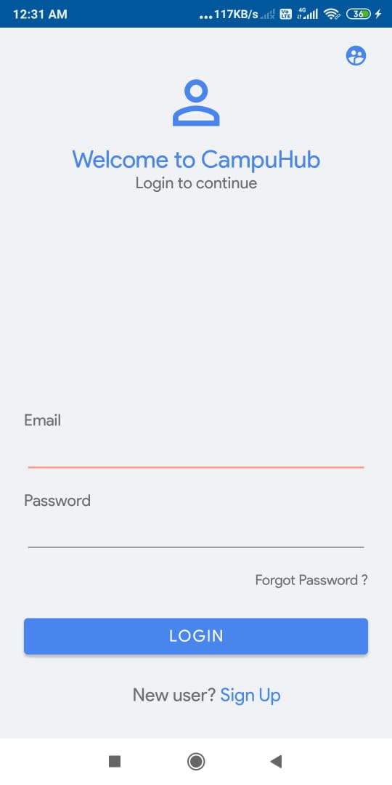 | 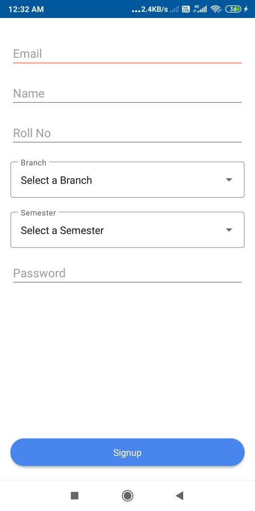 | 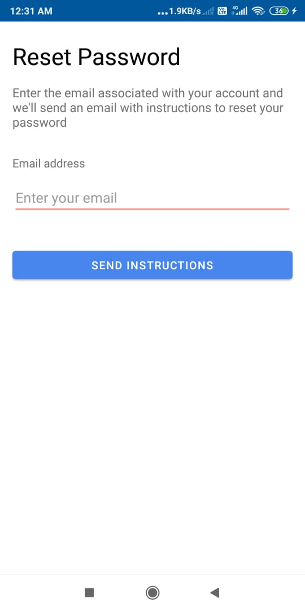 |
| 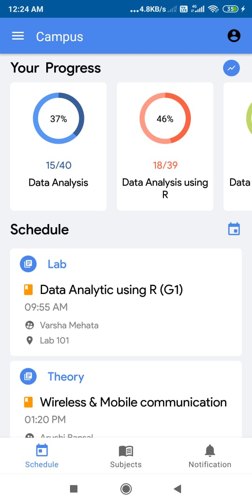 | 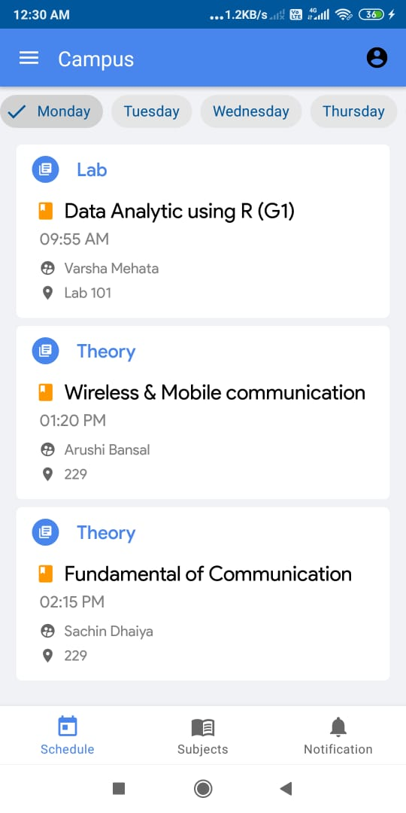 | 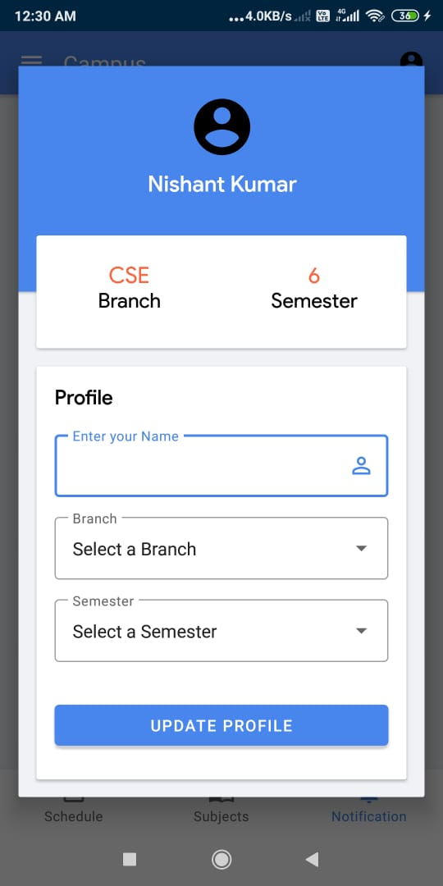 |
|  |  |  |
| 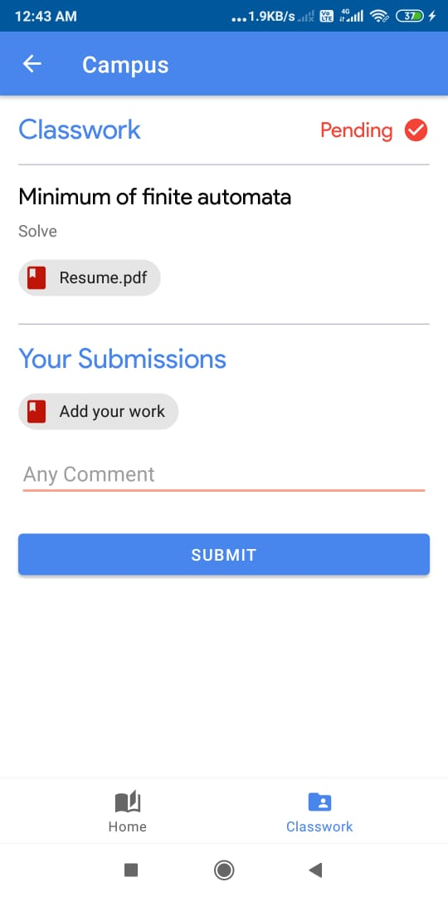 | 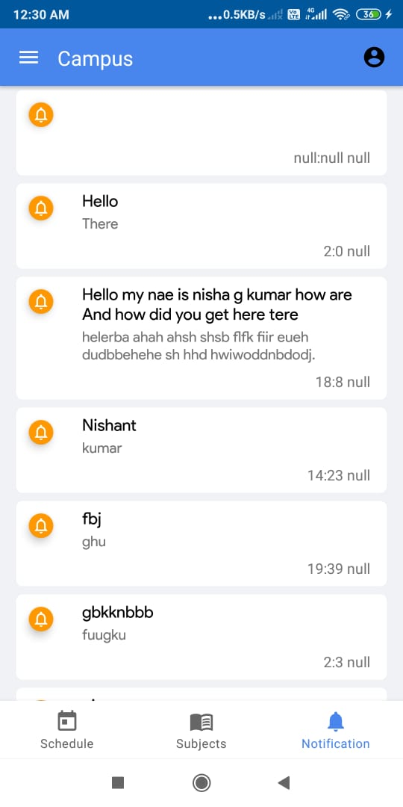 | 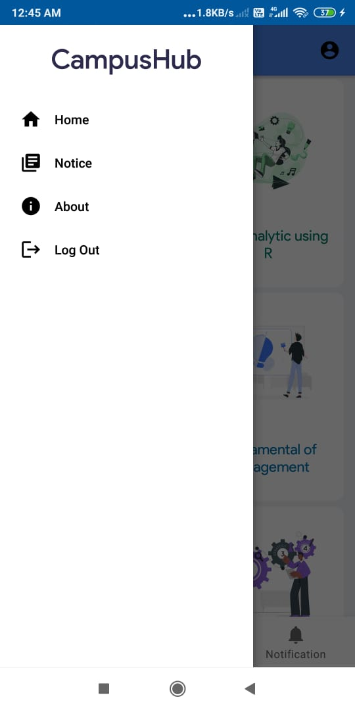 |
  
  
    
## 2.Faculty

Faculty can manange students Attendance and Classwork according to the Subject.

||||
|:----------------------------------------:|:-----------------------------------------:|:-----------------------------------------: |
| 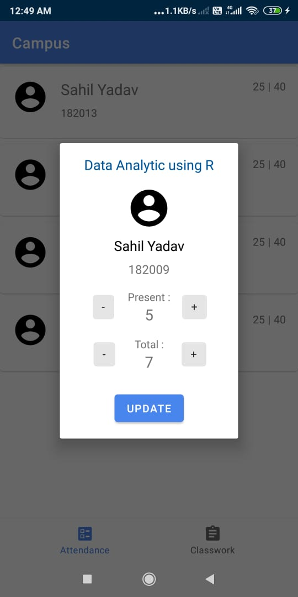 | 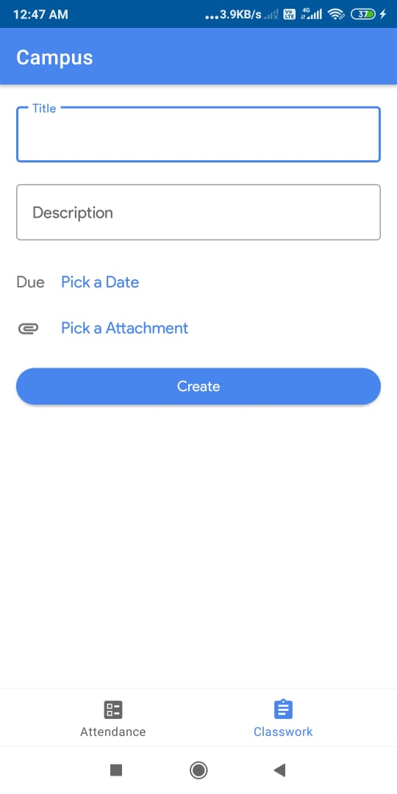 |

# Package Structure
    
    com.trendster.campus                   # Root Package
    .
    ├── adapters                           #Adaoters for respective Activity or Fragment
    |
    ├── models                             #Model Classes              
    │  
    ├── ui                                 # UI/View layer
    │   ├── faculty                        # Faculty Section's Activity and its fragments
    │   ├── fragments                      # Home Activity and its fragments
    ├── utils                              # Utility Classes / Kotlin extensions
    └── viewmodels                         # Viewmodels for all Activities and Fragments

## Architecture
This app uses [***MVVM (Model View View-Model)***](https://developer.android.com/jetpack/docs/guide#recommended-app-arch) architecture.

 

 ## Contact
If you need any help, you can connect with me.

Email - knishant362@gmail.com
